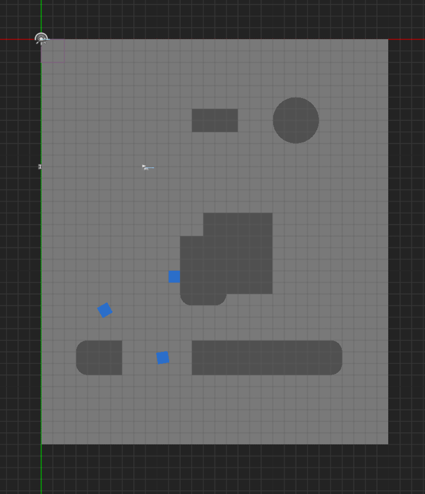

### Playable! General Agent (汎用エージェント) とは
チャットボットを通して自然言語によりゲームアプリをテストプレイすることができるプラットフォームです。
このプラットフォームは、ゲームアプリの画面をキャプチャし、画像認識技術を用いてゲームの状態を把握し、ゲームの操作を行います。

チャットボットは LLM (大規模言語モデル) を利用してユーザーからの自然言語による操作指示を解析し、ゲームをテストプレイします。
そのため、OpenAIのAPIキーが必要です。APIキーは、OpenAIのウェブサイトから取得してください。

# 環境の構築

[Playable! General Agent > 環境設定](https://docs.playable.qa/general-agent/#%E7%92%B0%E5%A2%83%E8%A8%AD%E5%AE%) を参照して、General Agent 用の Python 仮想環境を構築してください。

構築後は、一度 Anaconda Prompt を閉じた後でも、以下のコマンドを実行することで仮想環境を有効化できます。
```bash
conda activate generalagent
```

# 作業フォルダの作成

新規ゲームに対応するためには、General Agent のソースコードを適切に書き換える必要があります。そのための準備として、以下のことを行ってください。

ダウンロードした Playable! ライブラリの中にある `playable-general-agent` フォルダを丸ごとコピーし、`playable-general-agent-{新規ゲーム名}` にリネームします。

今回は、`{新規ゲーム名}` の部分を `template` とします。

# データの事前準備

## マップ画像の用意

Third Person Template にはマップ画像に相当するものが存在しないため、エディタ上でスクリーンショットを撮ったものをマップ画像として使用します。

エディタ画面左上の設定で、「並行投影」を「上」、「表示モード」を「ライティングなし」を選択し、エリア全体が画面に収まるように拡大/縮小してからスクリーンショットを撮りましょう。
こちらの画像を使っても問題ございません。



用意した画像のファイル名は、ビルドしたゲームバイナリに用いたレベル名と同名にしてください。
今回は`ThirdPersonMap` となります。

## マップスキャンデータの配置

Playable! General Agent では、 Map Scanner による地形のスキャンデータを使用します。

`Python/data/` フォルダ内に `tpt_work_space` フォルダを作成します。
マップスキャンで得られたスキャンデータ類を `Python/data/tpt_work_space` 以下に配置します。これらは `{Map Scanner のディレクトリ}/Python/map_data` にあります。 最終的に以下のようなファイル構成になっていることを確認してください。 以下に記載されていないファイルが含まれている分には問題ありません。

```plaintext
Python
└── data
    └── tpt_work_space
        ├── map_data
        │   ├── _map_list.yaml
        │   └── ThirdPersonMap.png
        └── map_graph
            └── ThirdPersonMap
                └── graph_data.bin
```
上記の`_map_list.yaml`内の`map_params`を「ThirdPersonMap」に変更してください。

```yaml
map_params:
  ThirdPersonMap: # ←ここを変更してください
    drop_threshold: -1000  # このマップにおける落下判定しきい値(コリジョンチェックで使用)
    save_data: none
    x:
      end: 3400
      start: -400
# 以下略
```

## ゲームバイナリの配置

パッケージ化した作成済みのゲームバイナリを含む `WindowsNoEditor` (Unreal Engine 4) 又は `Windows` (Unreal Engine 5) フォルダ全体を `Python` 以下に配置してください。

## 設定ファイルの編集

`Python/settings.yaml` ファイル内を以下のように設定してください。

`game_path`
- ゲームバイナリの配置で指定したフォルダ内のexeファイルのパスを指定します。

`game_window_title`
- ゲームのウィンドウタイトルを指定します。ゲームを起動した際のウィンドウタイトルを確認し、その文字列を指定してください。

`base_workspace_folder` 
- `tpt_work_space_base`と記載してください。
このファイルは後の工程で作成します。

`workspace_folder`
- マップスキャンデータの配置で作成した`tpt_work_space`と記載してください。

> ### settings.yaml
```yaml
# ゲーム情報
game:
  # 実際のローカル環境に合わせて変えてください *必須
  game_path: ./Windows/MyUEProject52.exe
  # 対象とするゲームウィンドウのタイトル(現状固定) *必須
  game_window_title: "MyUEProject52 (64-bit Development PCD3D_SM6) "

# オンラインマニュアル（メニュー > ヘルプ > マニュアル）のリンク先
# ※未設定の場合はヘルプメニューが非表示になります
# online_manual: https://mycompany.co.jp/general_agent_manual/

# work_space *必須
base_workspace_folder: ./data/tpt_work_space_base
workspace_folder: ./data/tpt_work_space
# 以下省略
```

# ゲーム情報の設定

Behavior Tree Maker を利用して「ゲーム情報」を設定します。

ゲーム情報には以下のものが含まれます。

1. ゲーム内情報
   - 起動したゲームから固有の「ゲーム内情報」を取得します。
2. ゲームの基本動作
   - LLM を利用して「ゲームの基本操作」を設定します。
3. 座標変換係数
    - ゲーム内の座標を画像座標に変換するための係数を設定します。
4. オブジェクト情報
    - ゲーム内のオブジェクト情報を設定して、指示を出すことができるようにします。

### Behavior Tree Maker の起動

まず、ゲーム情報の設定を行うための Behavior Tree Maker を起動します。
General Agent (Behavior Tree Maker) はゲーム情報設定時のみ「新規ゲーム適用モード」で起動する必要があります。

新規ゲーム適用時のオプション (`--add-new-game|-ang`) とデバッグオプション (`--debug|-d`) を追加した下記のコマンドを[環境の構築](#環境の構築)で構築された環境で実行し、 General Agent を起動して下さい。
```bash
python general_agent.py -ang -d
```
メニューから Behavior Tree Maker を起動して下さい。
- 【メニューバー > ツール > Behavior Tree Maker を起動】を選択します。

## 1. ゲーム内情報の設定

動画の流れで、ゲーム内情報を取得していきます。

[](http://www.youtube.com/watch?v=IXh8ewQe6yw)

1. タブを【ビヘイビアツリー作成に必要なデータ / ゲーム内情報】に切り替えて、【現在通信中のゲーム内情報を取得】ボタンをクリックします。
2. GamePad や PerformanceInfo に関連する情報の参照を解除し、必要なゲーム内情報のみを残します。 
   - 左側の【ゲーム内情報】カラムから、GamePad_ および PerformanceInfo_ で始まるアイテムを選択し、右側のカラムで【参照】チェックボックスをはずして、当該のアイテムを中央の【参照しないパラメータ】カラムに移動させて下さい。
3. 【LLM を利用して説明を記述】ボタンをクリックして、【仕様書からゲーム内情報を生成】ウィンドウを表示します。
4. 【LLM に解釈させてゲーム内情報を生成】ボタンをクリックします。

Third Person Template の場合、情報変数名が十分に適合しているため、【ゲーム内情報の仕様】カラムは空で構いません。

## 2. ゲームの基本操作の設定

[](http://www.youtube.com/watch?v=nbmq8gNGxbs)

1. 【ゲームの基本操作】タブに切り替え、【LLMを利用して仕様書から生成】ボタンをクリックして、【ゲームの基本操作を生成】ウィンドウを表示して下さい。
2. 左側の【ゲーム操作の仕様】カラムに、以下の内容をペーストします。
```bash
   左アナログスティック上: プレイヤー 前の移動
   左アナログスティック下: プレイヤー 後の移動
   左アナログスティック左: プレイヤー 左の移動
   左アナログスティック右: プレイヤー 右の移動
   右アナログスティック上: カメラ上
   右アナログスティック下: カメラ下
   右アナログスティック左: カメラ左
   右アナログスティック右: カメラ右
   A ボタン: ジャンプする
   LT + RT + 左スティック押し込み: デバッグカメラの ON/OFF
```
3. 【LLMに解釈させて基本操作を生成】ボタンをクリックして下さい。
4. 生成された「基本操作」を確認し、登録します。
   - 登録した「基本操作」に基づいて、システムは自動的に対応する動作ノードとビヘイビアーツリーを作成してくれます。
5. 左側の【未登録の操作】カラムから、任意のアイテムを選択し、右側のカラムで【登録】チェックボックスをONにすると、当該のアイテムが中央の【登録済みの操作】カラムに移動します。
6. 作成されたビヘイビアーツリーを確認します。
   - 【ビヘイビアーツリー】タブに切り替え、左側の【ノード一覧】カラムから、任意のアイテムを選択し、右側のカラムで【Start】ボタンをクリックします。 ビヘイビアツリーが正常に動作していることを確認できます。

> **注記:** Third Person テンプレートはデフォルトの EnterGame を使用しています。ゲームによっては、メニュー画面等からテストプレイを実行可能な画面に遷移するまでの操作を EnterGame に実装する必要があります。

## 3. 座標変換係数の設定

プレイヤーキャラクターのゲーム上の位置とマップ上の位置を合わせます。

[](http://www.youtube.com/watch?v=_XKgqj4mh_8)

1. ゲームウィンドウでキャラクターを操作し、目印となるような場所に移動させてください。
   - 動画では、左下のブロックに衝突した場所にキャラクターを配置しています。
> Game Map Window にキャラクター位置が表示されていない場合、Unreal Engine エディター上のレベル名とマップ名が一致しているか確認してください。

2. Game Map Window で、【プレイヤー位置設定】ボタンをクリックし、マップ上の対応する位置をクリックします。
3. 上記の1. と 2. を別の位置でもう一度行い、キャラクターの位置をマップ上に設定します。
   - ゲームウィンドウのキャラクターの位置とマップの位置がリンクしていることを確認してください。

## 4. オブジェクト情報の設定

一度ツールを終了して、`Python/data/tpt_work_space/object/`ディレクトリ以下にある `object_reference.yaml` と `object_sentences.yaml` にオブジェクト情報を追加します。

1. `object_reference.yaml` には、ゲーム内オブジェクトの座標を指定します。

2. `object_sentences.yaml` には、ゲーム内のオブジェクトとその参照名を記述します。参照名は、ユーザーがチャットボットに指示を出す際に使用する名前です。

下記を貼り付けてください。

>### object_reference.yaml
```yaml
map:
  - object_id: ThirdPersonMap
    map_id: ThirdPersonMap
    pos: [900, 1110, 92]
place:
  - object_id: PL_CUSTOM_1
    pos: [1304, 2115, 292]
    rot: [0, 0, 0]
    map_id: ThirdPersonMap
```

>### object_references.yaml
```yaml
map:
  ThirdPersonMap:
    - デフォルトマップ
place:
  PL_CUSTOM_1:
    - 場所1
```

### tpt_work_space フォルダのコピー

`tpt_work_space` フォルダをコピーして新たに `tpt_work_space_base` フォルダを作成します。

# General Agent の起動

通常の起動オプションで General Agent を起動します。

```bash
python general_agent.py
```

## 移動コマンドの確認

先ほど[オブジェクト情報の設定](#4-オブジェクト情報の設定)で指定した座標に移動させてみましょう。

チャットで「場所 1 に移動して」と送信します。その結果、プレイヤーキャラクターが「場所 1」に移動することを確認してみてください。

## チャットからのビヘイビアツリー自動生成の確認

以下の手順で、「Jump」コマンドを自動生成してみましょう。
> Jump コマンドの削除
1. メニューから Behaivor Tree Maker を起動してください。
   - 【メニューバー > ツール > Behavior Tree Maker を起動】を実行し起動します。
2. ビヘイビアツリーから「Jump」コマンドを削除します。
- 前述の「ゲームの基本操作の設定」で「Jump」コマンドは生成済みですが、チャットからのビヘイビアツリー自動生成を実施するために、ビヘイビアツリーから「Jump」コマンドを削除します。

   - 【ビヘイビアツリー】タブに切り替えます。
   - 【ノード一覧：】カラムから【Jump】を選択し【選択したノードを削除】ボタンをクリックして削除してください。
3. 【メニューバー > ファイル > 保存】を実行し、編集内容を保存してください。
4. 【メニューバー > ファイル > Behavior Tree Maker を終了】で終了してください。

> Jump コマンドの自動生成

1. チャットで「三回ジャンプして」を送信します。

   チャットに以下のメッセージが表示されることを確認します。
```bash
不足しているコマンドがあるため実行できません
※存在しないコマンドが必要です

すべてのタスクを終了してBehavior Tree Makerを起動し、新たにコマンドを作成しますか？
コマンドの仕様は以下の通りです
・作成するノード名: Jump
・実現したい動作: ジャンプして 1秒待って終了

「はい」か「いいえ」で答えてください
```
2. チャットで「はい」と送信してください。

   自動的に Behavior Tree Maker が起動され、自動生成が開始します。

   自動生成が終了したら、Behavior Tree Maker を終了し、チャットウィンドウに戻ります。

3. 再度、チャットで「三回ジャンプして」を送信してみてください。

   キャラクタープレイヤーがジャンプ動作を 3 回繰り返すことを確認できたら自動生成が成功しています。

お疲れさまでした。General Agent のテストプレイは以上になります。
詳しい内容、新規ゲームへの導入については[Playable! General Agent](https://docs.playable.qa/general-agent)をご覧ください。